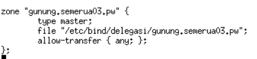

# Jarkom_Modul2_Praktikum_A03

## Soal 1

untuk membuat DNS untuk website bernama semerua03.pw kita buka file /etc/bind/named.conf.local pada server **Malang** lalu kita bisa menambahkan sesuai dengan gambar dibawah ini:


type master berarti server malang adalah DNS server master. dan kita tentukan juga path file yang digunakan untuk setting yaitu /etc/bind/jarkom/semerua03.pw.

Lalu kita buat file /etc/bind/jarkom/semerua03.pw, didalamnya kita menyesuaikan settingan dengan yang dibawah:


untuk mengarahkan ke Probolinggo, kita ganti ip pada `@ IN A` menjadi IP Probolinggo seperti gambar diatas. Setelah itu kita restart dengan `service bind9 restart`


Untuk melakukan test, bisa melakukan ping ke semerua03.pw pada UML Gresik, seperti gambar diatas. IP yang keluar adalah IP Probolinggo karena diarahkan ke Probolinggo.

## Soal 2

untuk membuat alias dari DNS semerua03.pw, yaitu www.semerua03.pw, kita buka lagi file /etc/bind/jarkom/semerua03.pw pada UML **Malang**. Lalu kita tambahkan line:

```
www IN  CNAME   semerua03.pw
```


Untuk melakukan test, pada UML **Gresik**, kita bisa jalankan command:
```
host -t CNAME www.semerua03.pw
```


Jika sudah terlihat seperti diatas, berarti implementasi alias sudah berhasil.

## Soal 3

Untuk menambahkan subdomain baru yang mengarah ke Probolinggo, yaitu penanjakan.semerua03.pw kita bisa tambahkan setting pada file /etc/bind/jarkom/semerua03.pw pada UML **Malang**, yaitu:
```
penanjakan  IN  A   10.151.73.36
```


Untuk melakukan test, kita bisa ping penanjakan.semerua03.pw dari UML Gresik. Jika sudah mengembalikan IP Probolinggo, berarti settingan sudah benar:


## Soal 4

Untuk melakukan reverse domain, kita buka file /etc/bind/named.conf.local, lalu kita tambahkan zone baru yang sesuai dengan gambar dibawah:


Lalu kita buat dan buka file /etc/bind/jarkom/73.151.10.in-addr.arpa, dan kita masukkan setting seperti gambar dibawah:


Untuk melakukan test, pada UML **Gresik**, kita bisa jalankan command:
```
host -t PTR 10.151.73.36
```


Dapat dilihat, bahwa 10.151.73.36 mengembalikan domain semerua03.pw, berarti reverse domain sudah berhasil.

## Soal 5

Untuk membuat DNS Server Slave pada **Mojokerto**, kita bisa membuka file pada UML **Malang** yaitu /etc/bind/named.conf.local dan menambahkan setting dibawah pada zome semerua03.pw
```
also-notify { 10.151.73.36; }; 
allow-transfer { 10.151.73.36; };
```


Setelah itu kita restart dengan `service bind9 restart`

lalu pada UML **Mojokerto**, buka file /etc/bind/named.conf.local dan tambahkan zone baru seperti gambar dibawah ini:


zone berisi: type slave berarti zone ini bertipe slave, masters adalah master dari slave ini yaitu malang, dan file dari zone ini sendiri.

Setelah itu kita restart dengan `service bind9 restart`

Untuk melakukan test, kita bisa matikan service bind9 di **Malang** menggunakan command
```
service bind9 stop
```


Lalu kita lakukan ping semerua03.pw pada Gresik, jika masih bisa diping seperti gambar dibawah, berarti DNS slave sudah sukses dibuat.


## Soal 6

- UML Malang

Untuk menambahkan subdomain dengan alamat gunung.semerua03.pw yang didelegasikan pada server MOJOKERTO dan mengarah ke IP
Server PROBOLINGGO, kita buka file /etc/bind/jarkom/semerua03.pw pada UML **Malang**. Didalamnya kita tambahkan settingan:
```
ns1     IN  A   10.151.73.35
gunung  IN  NS  ns1
```
Sehingga akan sesuai dengan gambar dibawah:


edit file /etc/bind/named.conf.options pada UML **Malang**, comment `dnssec-validation auto` dan tambahkan `allow-query{any;};`

Setelah itu kita restart dengan `service bind9 restart`

- UML Mojokerto

Pada UML **Mojokerto**, edit file /etc/bind/named.conf.options pada UML **Malang**, comment `dnssec-validation auto` dan tambahkan `allow-query{any;};`

Setelah itu kita buka file /etc/bind/named.conf.local lalu kita buat zone baru seperti gambar dibawah ini:



Kemudian kita buat dan buka file /etc/bind/delegasi/gunung.semerua03.pw, kemudian kita sesuaikan dengan gambar dibawah. pada `@  IN  A` dimasukkan IP Probolinggo, sesuai dengan permintaan soal.


Lalu kita restart dengan `service bind9 restart`

Setelah itu kita test dengan cara melakukan ping gunung.semerua03.pw pada UML Gresik. Jika sudah keluar IP Probolinggo seperti gambar dibawah, berarti kita sudah berhasil melakukan delegasi ke Mojokerto.


## Soal 7

Untuk membuat subdomain naik.gunung.semerua03.pw yang mengarah ke mojokerto, kita mengedit file /etc/bind/delegasi/gunung.semerua03.pw dan menambahkan setting seperti gambar dibawah:
```
naik    IN  A   10.151.73.36
```


Setelah itu kita restart dengan `service bind9 restart`

Lalu kita melakukan test dengan cara ping naik.gunung.semerua03.pw pada UML Gresik. Jika sudah keluar IP Probolinggo seperti gambar dibawah berarti sudah berhasil membuat subdomain.


## Soal 8

Pertama-tama kita harus menginstall apache2 dan php5 dengan command:

```
apt-get install apache2
apt-get install php5
```

Copy file default menjadi semerua03.pw yang ada di /etc/apache2/sites-available

Buka file tersebut /etc/apache2/sites-available/semerua03.pw dan tambahkan setting berikut: 
```
ServerName semerua03.pw
ServerAlias www.semerua03.pw
```
dan ubah DocumentRoot menjadi 
```
DocumentRoot /var/www/semerua03.pw
```


Lakukan enable pada config site yang dibuat dengan `a2ensite semerua03.pw`, setelah itu restart dengan `service apache2 restart`

Setelah itu kita pindah ke folder /var/www, lalu kita menjalankan `wget 10.151.36.202/semeru.pw.zip` untuk mendapatkan file websitenya. Setelah itu kita jalankan `apt-get install Unzip`, dan kemudian unzip file yang sudah didownload tadi. Setelah itu rename nama filenya menjadi "semerua03.pw"

Setelah itu kita bisa test dengan buka semerua03.pw di browser, jika sudah sukses maka akan muncul seperti gambar ini:


## Soal 9

Untuk membuat mod rewrite ini, kita buat file .htaccess di /var/www/semerua03.pw dengan command:
```
nano /var/www/semerua03.pw/.htaccess
```
Lalu sesuaikan isinya dengan gambar berikut:


Rulenya di situ adalah jika request oleh user adalah hanya "home", maka akan di redirect ke index.php/home.

Selanjutnya kita edit /etc/apache2/sites-available/semerua03.pw dan tambahkan:


Setelah itu restart apache dengan `service apache2 restart` dan buka pada browser semerua03.pw/home, maka akan menampilkan:


## Soal 10

Copy file default menjadi penanjakan.semerua03.pw yang ada di /etc/apache2/sites-available

Buka file tersebut /etc/apache2/sites-available/penanjakan.semerua03.pw dan tambahkan setting berikut: 
```
ServerName penanjakan.semerua03.pw
ServerAlias www.penanjakan.semerua03.pw
```
dan ubah DocumentRoot menjadi 
```
DocumentRoot /var/www/penanjakan.semerua03.pw
```


Lakukan enable pada config site yang dibuat dengan `a2ensite penanjakan.semerua03.pw`, setelah itu restart dengan `service apache2 restart`

Setelah itu kita pindah ke folder /var/www, lalu kita menjalankan `wget 10.151.36.202/penanjakan.semeru.pw.zip` untuk mendapatkan file websitenya. Kemudian unzip file yang sudah didownload tadi. Setelah itu rename nama filenya menjadi "penanjakan.semerua03.pw"

Setelah itu kita bisa test dengan buka penanjakan.semerua03.pw di browser, jika sudah sukses maka akan muncul seperti gambar ini:


## Soal 11

Untuk Directory Listing pada nomor 11 ini, kita perlu mengedit /etc/apache2/sites-available/penanjakan.semerua03.pw. Lalu tambahkan seperti gambar dibawah ini:


yang atas akan memperbolehkan Directory Listing pada /public, sedangkan yang bawah akan melarang Directory Listing pada semua folder yang ada di dalam /public.

Lalu lakukan restart `service apache2 restart`. Lalu jika kita buka folder public, maka masih bisa melihat seperti gambar ini:


Namun jika kita mengakses folder yang ada di dalam public, maka akan tampil seperti gambar:


## Soal 12

Untuk menampilkan custom HTTP Error page, kita buat file .htaccess pada /var/www/penanjakan.semerua03.pw/ dan mengisi file nya menjadi:


Setelah itu kita tambahkan pada /etc/apache2/sites-available/penanjakan.semeru03.pw sesuai dengan gambar dibawah agar konfigurasi .htaccess dapat berjalan.


Jika mengakses page yang tidak ada dalam website ini, maka akan keluar seperti gambar dibawah:


## Soal 13

Untuk membuat Directory Alias seperti pada soal, kita edit **/etc/apache2/sites-available/penanjakan.semerua03.pw**. Setelah itu kita tambahkan setting berikut kedalamnya:


Lalu lakukan restart `service apache2 restart`. Setelah itu bisa mencoba membukanya di browser. Jika berhasil maka akan keluar seperti gambar berikut:


Kenapa Forbidden? karena pada soal nomor 11 tadi, folder javascript tersebut tidak diperbolehkan untuk Directory Listing.

## Soal 14

Untuk domain naik.gunung.semerua03.pw, kita buat lagi sama seperti diatas. Copy file default menjadi naik.gunung.semerua03.pw yang ada di /etc/apache2/sites-available

Buka file tersebut /etc/apache2/sites-available/naik.gunung.semerua03.pw dan tambahkan setting berikut: 
```
ServerName naik.gunung.semerua03.pw
ServerAlias www.naik.gunung.semerua03.pw
```
dan ubah DocumentRoot menjadi 
```
DocumentRoot /var/www/naik.gunung.semerua03.pw
```

Untuk mengganti port menjadi 8888, ganti port yang ada disebelah tulisan VirtualHost menjadi 8888.


Lakukan enable pada config site yang dibuat dengan `a2ensite penanjakan.semerua03.pw`, setelah itu restart dengan `service apache2 restart`.

Lalu edit file /etc/apache2/ports.conf, dan tambahkan `Listen 8888` sehingga sesuai dengan gambar dibawah:


Setelah itu kita pindah ke folder /var/www, lalu kita menjalankan `wget 10.151.36.202/naik.gunung.semeru.pw.zip` untuk mendapatkan file websitenya. Kemudian unzip file yang sudah didownload tadi. Setelah itu rename nama foldernya menjadi "naik.gunung.semerua03.pw"

Setelah itu kita bisa test dengan buka naik.gunung.semerua03.pw:8888.

## Soal 15

Untuk meng-generate id dan passwordnya, kita bisa jalankan perintah dibawah:

```
htpasswd -bc /var/www/naik.gunung.semerua03.pw/.htpasswd semeru kuynaikgunung
```

Setelah itu kita buat file .htaccess pada /var/www/naik.gunung.semerua03.pw dan isikan file tersebut sesuai dengan gambar dibawah:


Lalu edit **/etc/apache2/sites-available/naik.gunung.semerua03.pw** dan tambahkan konfigurasi berikut:


Setting ini adalah agar .htaccess dapat berjalan. Lalu jika kita buka naik.gunung.semerua03.pw:8888, kita akan mendapat screen seperti ini:


Dan kalau kita sudah sign in, maka akan menampilkan page seperti berikut:


## Soal 16

Untuk mengalihkan secara otomatis dari IP Probolinggo ke http://semeruyyy.pw, edit file **/etc/apache2/sites-available/default**, lalu tambahkan setting seperti berikut
```
Redirect / http://semerua03.pw
```


Jika mencoba untuk mengakses website melalui IP Probolinggo, maka akan langsung diredirect ke alamat semerua03.pw, sesuai dengan gambar dibawah:


## Soal 17

Untuk mengarahkan semua request gambaryang memiliki substring “semeru”  menuju semeru.jpg, maka edit /var/www/penanjakan.semerua03.pw/.htaccess dan masukkan module rewrite seperti gambar dibawah ini:


Karena mod rewrite sudah diaktifkan bersamaan dengan soal nomor 12 tadi, maka tidak perlu mengubahnya lagi. RewriteRule yang `.*semeru.*` disitu akan melakukan match pada 0 atau lebih sembarang karakter yang diikuti string "semeru" dan diikuti 0 atau lebih sembarang karakter. Sehingga akan melakukan match semua string yang memiliki substring "semeru". Lalu akan diarahkan kepada `public/images/semeru.jpg`

Jika mencoba untuk mengakses gambar bukansemeruaja, maka akan dialihkan kepada gambar "semeru.jpg", seperti gambabr dibawah:


